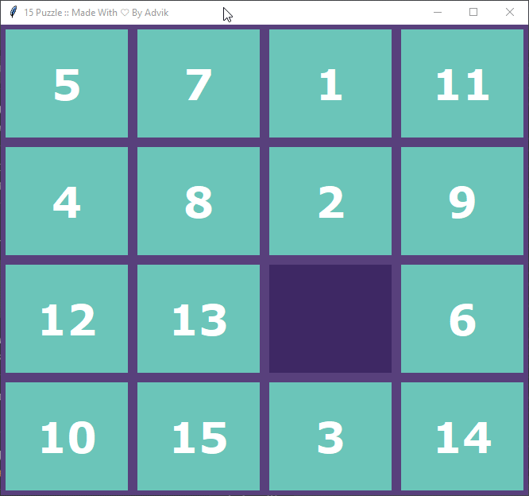
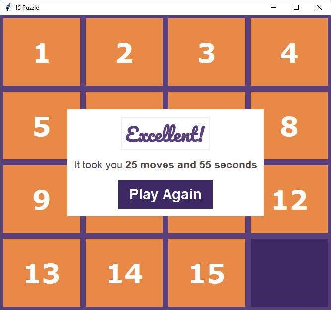

# 15-Puzzle




The 15 puzzle is a sliding puzzle that consists of a frame of numbered square tiles in random order with one tile missing. The goal of the puzzle is to place the tiles in order by making sliding moves that use the empty space.

## Playing It
You Could Clone the repo and run the game
```python
$ git clone https://github.com/ADV1K/15-Puzzle
$ cd 15-Puzzle
$ python 15puzzle.py
```
Or if you are on Window then you could just download the game from here: 
